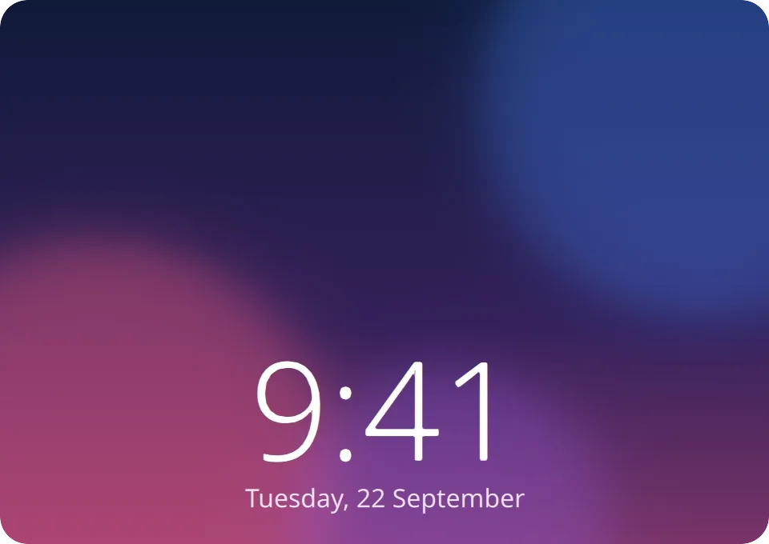

<p align="center">
  
</p>

<h1 align="center">plasma-face-unlock</h1>

<h3 align="center">Face ID for KDE Plasma.</h3>

<p align="center">
  Look at the screen and it unlocks: the lock screen, sudo and admin prompts. A photo on a phone does not fool it.
</p>

<h5 align="center">
  <a href="#install">Install</a> |
  <a href="#how-to-use">How to use</a> |
  <a href="#is-it-safe">Is it safe?</a> |
  <a href="https://github.com/LoonixTools/plasma-face-unlock/issues">Report a bug</a>
</h5>

<p align="center">
  <a href="https://buymeacoffee.com/felitendo"></a>
</p>

<p align="center">
  
</p>

<p align="center">
  
</p>

Come back to your locked screen and look at it. A bubble drops down at the top, finds your face,
and you are in. It works for `sudo` and Plasma's admin prompts too, if you want. Everything runs on
your computer, and your face is saved as numbers, never as a picture.

## Install

**Arch, CachyOS, EndeavourOS, Manjaro** (AUR)

```bash
yay -S plasma-face-unlock
```

**Fedora**

```bash
sudo curl -fsSL -o /etc/yum.repos.d/plasma-face-unlock.repo \
  https://loonixtools.github.io/plasma-face-unlock/plasma-face-unlock.repo
sudo dnf install plasma-face-unlock
```

**Debian, Kubuntu**

```bash
codename="$(sed -n 's/^VERSION_CODENAME=//p' /etc/os-release)"
sudo install -d -m 0755 /etc/apt/keyrings
curl -fsSL https://loonixtools.github.io/plasma-face-unlock/KEY.gpg \
  | sudo gpg --dearmor -o /etc/apt/keyrings/plasma-face-unlock.gpg
echo "deb [signed-by=/etc/apt/keyrings/plasma-face-unlock.gpg] https://loonixtools.github.io/plasma-face-unlock/deb/$codename ./" \
  | sudo tee /etc/apt/sources.list.d/plasma-face-unlock.list
sudo apt update && sudo apt install plasma-face-unlock
```

The packages are built for the current release of each. Updates then come with your normal system
updates.

You need Plasma 6 on Wayland and a camera. Infrared cameras (the Windows Hello kind) work too.

## How to use

```bash
plasma-face-unlock
```

This opens a menu. Press **1** and follow the setup window: look at the camera, then turn your head
slowly in a circle until the ring is full. Then lock the screen and look at it.

| Key | |
|---|---|
| **1** | Turn face unlock on or off |
| **2** | Add another face, for example with glasses |
| **3** | Rename, turn off or delete faces |
| **4** | Settings: sudo, admin prompts, photo check, camera, bubble style, animation speed and more |
| **5** | One test scan that shows what the camera sees. Try this first when something does not work. |

Without the menu: `plasma-face-unlock enable`, `disable`, `setup [NAME]`, `faces`, `remove ID`,
`test` and `status`.

## Is it safe?

It is a convenience, not a security upgrade. Face ID on a phone sees your face in 3D. A webcam only
sees a flat picture.

- You do not have to blink. A photo on a phone or tablet, or a glossy print, is still refused:
  it gives itself away by its reflection and its straight edges.
- A matte printed photo can get past that. Set the photo check to *strict* in the settings: then
  the face has to blink or turn a little, and a photo can do neither.
- A video of you can still get in.
- Five failed tries in a row pause it for 15 minutes, or until you use your password.
- Only root can read your face data. Adding or deleting a face always needs your password.
- sudo and admin prompts never take a face over SSH.

If the computer guards something important, leave sudo and admin prompts off.

## How it works

| | |
|---|---|
| `plasma-face-unlockd` | Runs as root when needed. It owns the camera and the face data and decides. |
| `plasma-face-unlock-agent` | Runs in your session. It watches the lock screen and draws the bubble. |
| `pam_plasma_face_unlock.so` | Lets sudo and admin prompts ask the daemon. No match: you type your password as usual. |
| `plasma-face-unlock` | The menu. |

Two small networks from the OpenCV model zoo find the face (YuNet) and turn it into numbers (SFace).
They run on the CPU in a few milliseconds. The lock screen is unlocked through logind, the same way
`loginctl unlock-session` does it. `man plasma-face-unlock` has all the details.

## Build from source

```bash
make models   # downloads the two networks and checks them
make
make test
sudo make install
```

You need CMake, a C++20 compiler, Qt 6, LayerShellQt, KI18n, OpenCV 4.5.4 or newer (with DNN),
Linux-PAM and libsystemd. `scdoc` and `msgfmt` are optional (man page, translations).
[packaging/README.md](packaging/README.md) explains releases.

## Credits

- [Glance](https://github.com/jonnyoo/glance) by Jonathan Zhou (MIT): face unlock for the Mac. The
  idea, the look of the bubble and the photo check come from there. The code here is new.
- [YuNet](https://github.com/opencv/opencv_zoo/tree/main/models/face_detection_yunet) (MIT) and
  [SFace](https://github.com/opencv/opencv_zoo/tree/main/models/face_recognition_sface) (Apache-2.0)
  from the OpenCV model zoo.

## License

GPL-3.0-or-later.
