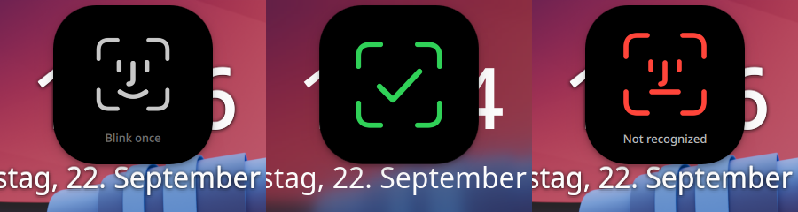

<p align="center">
  
</p>

<h1 align="center">plasma-face-unlock</h1>

<h3 align="center">Face ID for KDE Plasma.</h3>

<p align="center">
  Look at the screen and it unlocks. Works for the lock screen, sudo and admin prompts, and a photo of you is not enough.
</p>

<h5 align="center">
  <a href="#how-to-use">How to use</a> |
  <a href="#how-to-install">Install</a> |
  <a href="#is-it-safe">Is it safe?</a> |
  <a href="https://github.com/LoonixTools/plasma-face-unlock/issues">Report a bug</a>
</h5>

<p align="center">
  <a href="https://buymeacoffee.com/felitendo"></a>
</p>

<p align="center">
  
</p>

Come back to your locked screen, move the mouse, look at it: a little bubble drops down at the top,
the face in it looks around, turns into a tick, and you are in. The same for `sudo` in a terminal
and for the admin password prompts of Plasma, if you want. Everything runs on your machine, and
your face is stored as numbers, never as a picture.

The look of the bubble and the photo check are inspired by [Glance](https://github.com/jonnyoo/glance)
(face unlock for the Mac). The code is written from scratch for Plasma.

## How to use

Just run `plasma-face-unlock`. This will open the configuration TUI that looks like this:

```
  Plasma Face Unlock

  Face unlock                    ON

  Faces                          2 (Felix, Felix with glasses)
  Camera                         Integrated Camera
  Lock screen                    on
  sudo                           on
  Admin prompts                  off
  Photo check                    strict (blink or turn your head)
  Last unlock                    2 minutes ago

  [1] Turn face unlock on or off
  [2] Add a face
  [3] Faces
  [4] Settings
  [5] Try it
  [q] Quit

  >
```

Press `[1]`. The first time, it opens the setup window: look at the camera, then move your head
slowly in a circle until the ring around the picture is full (like setting up Face ID on a phone).
It asks for your password once before it adds the face. After that, lock the screen and look at it.

`[5]` does one scan and shows what the camera sees, which helps a lot when something does not work.
`[4]` has everything else:

```
  Settings

  ▸ Unlock the lock screen                        ON
    Look when somebody comes back to the screen   ON
    Look right after the screen locks             OFF

    Use for sudo in a terminal*                   ON
    Use for admin prompts*                        OFF

    Photo check*                                  strict (blink or turn your head)
    How closely a face has to match*              normal
    Only while looking at the screen*             ON
    Camera*                                       automatic (Integrated Camera)
    How long one look lasts*                      5 seconds
    Learn from every unlock*                      ON
    Not while the lid is closed*                  ON

    Show the bubble at the top                    ON
    Bubble style                                  island with the face
    Bubble for sudo and admin prompts too         ON

  Settings marked * are for the whole computer and ask for your password.
  Up/Down: select, Space or Right: change, q: back
```

## How to install

**Arch**

```bash
yay -S plasma-face-unlock
```

**Fedora**

```bash
sudo curl -fsSL -o /etc/yum.repos.d/plasma-face-unlock.repo \
  https://loonixtools.github.io/plasma-face-unlock/plasma-face-unlock.repo
sudo dnf install plasma-face-unlock
```

**Debian** (13 or newer) **and Kubuntu** (25.04 or newer)

```bash
sudo install -d -m 0755 /etc/apt/keyrings
curl -fsSL https://loonixtools.github.io/plasma-face-unlock/KEY.gpg \
  | sudo gpg --dearmor -o /etc/apt/keyrings/plasma-face-unlock.gpg
echo "deb [signed-by=/etc/apt/keyrings/plasma-face-unlock.gpg] https://loonixtools.github.io/plasma-face-unlock/deb ./" \
  | sudo tee /etc/apt/sources.list.d/plasma-face-unlock.list
sudo apt update && sudo apt install plasma-face-unlock
```

You need Plasma 6 on Wayland and a camera. An infrared camera (the Windows Hello kind) works too.

## Is it safe?

**It is a convenience, not a security upgrade.** A phone builds a 3D map of your face with a dot
projector. A webcam only sees a flat picture, so this cannot be as safe as Face ID. What it does:

- A photo, printed or on a phone, held up and turned any way, **does not** get in. With the photo
  check on *strict* (the default) the face has to blink or turn a little, and a photo can do neither.
- A screen or a glossy print held up to the camera throws back one big flat reflection, and a phone
  has straight edges around the face. Both fail the scan straight away.
- A **video** of you blinking can still get through. So can, some of the time, a photo that is
  curled a lot and turned a lot.
- Five failed tries in a row pause it for 15 minutes, or until you use your password.
- Your face data can only be read by root. Adding or deleting a face always needs your password,
  never a face.
- sudo and admin prompts never take a face over SSH, or when you are not sitting at the machine.

If the machine guards something that matters, leave sudo and admin prompts off.

## How it works

Four parts:

| | |
|---|---|
| `plasma-face-unlockd` | Runs as root, started on demand. Owns the camera and the face data, and decides. |
| `plasma-face-unlock-agent` | Runs in your session. Watches the lock screen, draws the bubble, is the setup window. |
| `pam_plasma_face_unlock.so` | Lets sudo and polkit ask the daemon. |
| `plasma-face-unlock` | This menu. |

Faces are found with **YuNet** and turned into 128 numbers with **SFace**, two small networks from
the OpenCV model zoo that run on the CPU in a few milliseconds. Two pictures of the same person give
numbers that point the same way; how much they do is the match.

**The photo check** looks for a sign of life on top of the match:

- **Blink:** the dark of both eyes shrinks to a line and comes back within the fraction of a second a
  blink takes, while the rest of the face holds still.
- **Head turn:** the eyes and the corners of the mouth lie close to one plane, so for a flat picture
  they predict exactly where the nose has to go when it is turned. A real nose sticks out of that
  plane and misses the prediction by about as much as the head turned.

The head turn check is tested against simulated heads and photos (`make test`): photos turned up to
60 degrees at heavy camera noise never pass, real heads of all shapes pass 98% of the time.

**The lock screen** is not unlocked through its password prompt (Plasma runs fingerprints there, but
only once per lock). Instead the agent notices the screen locking, scans when you come back (a key,
the mouse, the lid, waking from sleep), and unlocks the session through logind, just like
`loginctl unlock-session`. KWin lets the bubble show above the lock screen because the agent's desktop
file asks for it.

**sudo and admin prompts** get one line in front of their PAM stack:

```
-auth  sufficient  /usr/lib/security/pam_plasma_face_unlock.so
```

A match lets you in, anything else falls through to the password. The dash makes PAM skip it quietly
if the module is ever missing, so sudo keeps working even after uninstalling. Turning it off takes out
exactly that line.

The man page (`man plasma-face-unlock`) has all the details.

## Commands

| Command | |
|---|---|
| `plasma-face-unlock` | Interactive menu |
| `… enable` | Turn on (sets up a face first if needed) |
| `… disable` | Turn off, keep the faces |
| `… setup [NAME]` | Add a face |
| `… faces` | List the faces |
| `… remove ID` | Delete a face |
| `… test` | One scan, with what the camera sees |
| `… status` | What is on |

## Building from source

```bash
make models   # downloads the two networks, checked against pinned checksums
make
make test
sudo make install
```

Needs CMake, a C++20 compiler, Qt 6 (Core, DBus, Network, Gui, Quick, WaylandClient), LayerShellQt,
KIdleTime, KI18n, OpenCV 4.5.4 or newer with the DNN module, Linux-PAM and libsystemd. Optionally
`msgfmt` (gettext) for translations and `scdoc` for the man page. Supports `PREFIX` and `DESTDIR`.
`make check` runs syntax checks and shellcheck.

To try it without a camera, point the camera setting at a folder of pictures (`images:/path`) or a
video (`file:/path.mp4`) in `/etc/plasma-face-unlock/config`.

See [packaging/README.md](packaging/README.md) for release builds and repo signing.

## Credits

- [Glance](https://github.com/jonnyoo/glance) by Jonathan Zhou (MIT): the idea, the look of the bubble
  and the model of deny and confirm cues.
- [YuNet](https://github.com/opencv/opencv_zoo/tree/main/models/face_detection_yunet) (MIT) and
  [SFace](https://github.com/opencv/opencv_zoo/tree/main/models/face_recognition_sface) (Apache-2.0)
  from the OpenCV model zoo.

## License

GPL-3.0-or-later.
