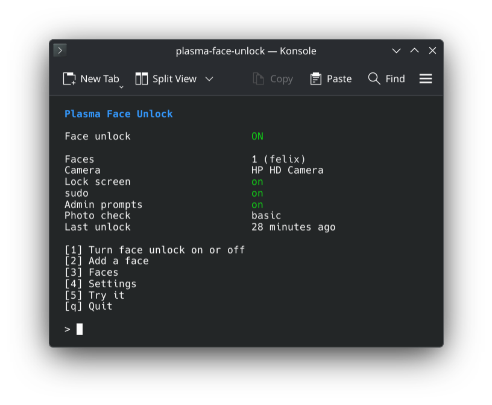
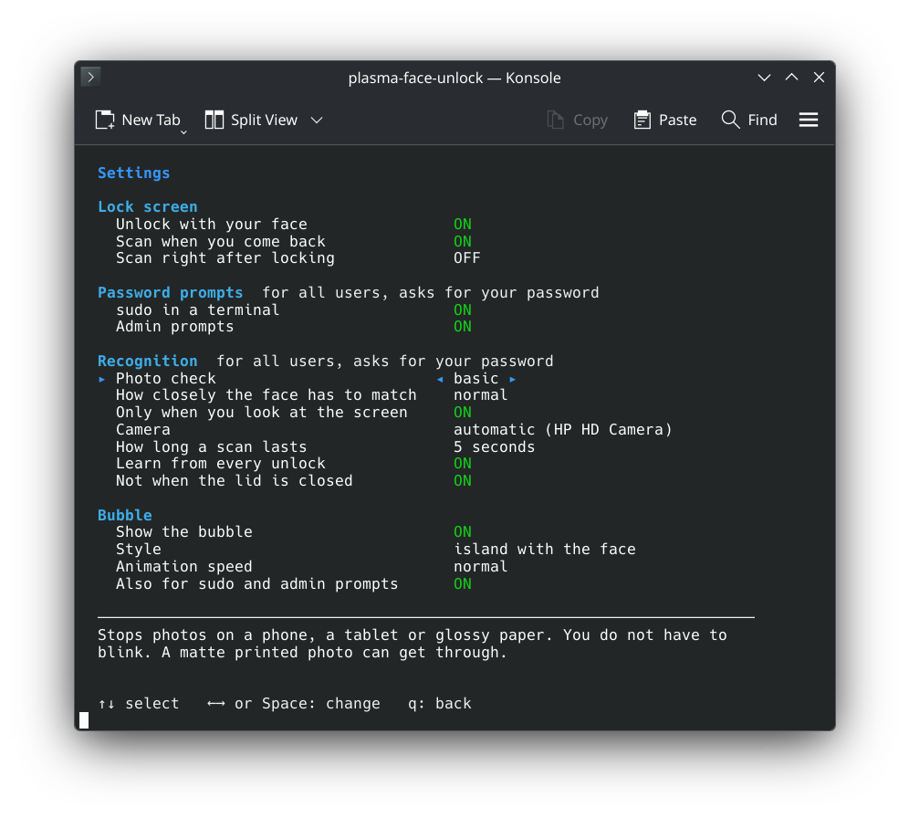

<p align="center">
  
</p>

<h1 align="center">plasma-face-unlock</h1>

<h3 align="center">Face ID for KDE Plasma.</h3>

<p align="center">
  Unlock the lock screen, sudo and admin prompts with your face.
</p>

<h5 align="center">
  <a href="#install">Install</a> |
  <a href="#how-to-use">How to use</a> |
  <a href="#is-it-safe">Is it safe?</a> |
  <a href="https://github.com/LoonixTools/plasma-face-unlock/issues">Report a bug</a>
</h5>

<p align="center">
  <a href="https://buymeacoffee.com/felitendo"></a>
</p>

<p align="center">
  
</p>

<p align="center">
  
</p>

## Install

<details>
<summary><b>Arch</b>, CachyOS, EndeavourOS, Manjaro</summary>

```bash
yay -S plasma-face-unlock
```

</details>

<details>
<summary><b>Fedora</b></summary>

```bash
sudo curl -fsSL -o /etc/yum.repos.d/plasma-face-unlock.repo \
  https://loonixtools.github.io/plasma-face-unlock/plasma-face-unlock.repo
sudo dnf install plasma-face-unlock
```

</details>

<details>
<summary><b>Debian</b>, Kubuntu</summary>

```bash
codename="$(sed -n 's/^VERSION_CODENAME=//p' /etc/os-release)"
sudo install -d -m 0755 /etc/apt/keyrings
curl -fsSL https://loonixtools.github.io/plasma-face-unlock/KEY.gpg \
  | sudo gpg --dearmor -o /etc/apt/keyrings/plasma-face-unlock.gpg
echo "deb [signed-by=/etc/apt/keyrings/plasma-face-unlock.gpg] https://loonixtools.github.io/plasma-face-unlock/deb/$codename ./" \
  | sudo tee /etc/apt/sources.list.d/plasma-face-unlock.list
sudo apt update && sudo apt install plasma-face-unlock
```

</details>

Needs Plasma 6 on Wayland and a camera. Updates come with your system updates.

## How to use

```bash
plasma-face-unlock
```

<p align="center">
  
</p>

Press **1** and look at the camera. Then lock the screen and look at it.

<details>
<summary>Settings</summary>

<p align="center">
  
</p>

</details>

## Is it safe?

A convenience, not extra security. A webcam only sees a flat picture.

| | |
|---|---|
| Photo or video on a phone, tablet or glossy screen | ✅ Stopped |
| Matte printed photo | ⚠️ Only stopped with photo check *strict* |
| Video of you on a big matte screen | ❌ Can get in |
| Five failed tries | ⏸️ Paused for 15 minutes |
| Your face data | 🔒 Numbers, no pictures. Root only. |
| sudo over SSH | 🚫 Never unlocked by a face |

## More

<details>
<summary>How it works</summary>

| | |
|---|---|
| `plasma-face-unlockd` | The root service. Owns the camera and the face data. |
| `plasma-face-unlock-agent` | Runs in your session. Watches the lock screen, draws the bubble. |
| `pam_plasma_face_unlock.so` | Lets sudo and admin prompts ask the service. |
| `plasma-face-unlock` | The menu. |

Two small networks from the OpenCV model zoo run on the CPU: YuNet finds the face, SFace turns it
into numbers. All details: `man plasma-face-unlock`.

</details>

<details>
<summary>Build from source</summary>

```bash
make models
make
make test
sudo make install
```

Needs CMake, a C++20 compiler, Qt 6, LayerShellQt, KI18n, OpenCV 4.5.4+ (with DNN), Linux-PAM and
libsystemd.

</details>

## Credits

- [Glance](https://github.com/jonnyoo/glance) by Jonathan Zhou: the idea and the look of the bubble.
- [YuNet](https://github.com/opencv/opencv_zoo/tree/main/models/face_detection_yunet) and
  [SFace](https://github.com/opencv/opencv_zoo/tree/main/models/face_recognition_sface) from the
  OpenCV model zoo.

GPL-3.0-or-later.
